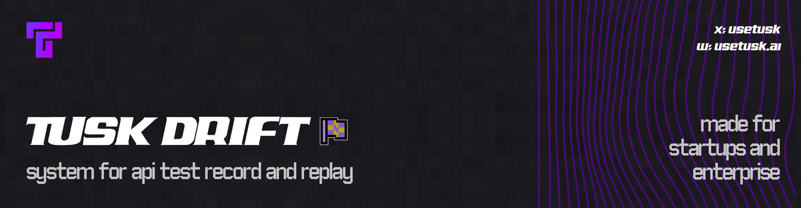

Tusk Drift is an API test record/replay system that lets you run realistic tests generated from real traffic. This CLI orchestrates local and CI test runs, coordinating with a Tusk Drift SDK and Tusk Drift Cloud.

<div align="center">


[](https://github.com/Use-Tusk/tusk-drift-cli/actions/workflows/main.yml)
[](https://www.bestpractices.dev/projects/11340)
[](https://securityscorecards.dev/viewer/?uri=github.com/Use-Tusk/tusk-drift-cli)
<br>
[](https://goreportcard.com/report/github.com/Use-Tusk/tusk-drift-cli)
[](https://opensource.org/licenses/Apache-2.0)
[](https://x.com/usetusk)
[](https://join.slack.com/t/tusk-community/shared_invite/zt-3fve1s7ie-NAAUn~UpHsf1m_2tdoGjsQ)

</div>

SDKs:

- [Node.js](https://github.com/Use-Tusk/drift-node-sdk)
- [Python](https://github.com/Use-Tusk/drift-python-sdk)
- ...more to come!

## Features

- Replay recorded traces against your service under test
- Deterministic outbound I/O via local mock server
- JSON response comparison with dynamic field rules (UUIDs, timestamps, dates, etc.)
- Tusk Drift Cloud: fetch and replay tests stored with Tusk, and upload test results for intelligent classification of regressions in CI/CD checks

<div align="center">


<p><a href="https://github.com/Use-Tusk/drift-node-demo">Try it on a demo repo →</a></p>

</div>

## Install

### Quick install (recommended)

**Linux/macOS:**

Install the latest version:

```bash
curl -fsSL https://cli.usetusk.ai/install.sh | sh
```

To install a specific version:

```bash
curl -fsSL https://cli.usetusk.ai/install.sh | sh -s -- v1.2.3
```

Linux additional dependencies (for replay sandboxing):

- Debian/Ubuntu: `sudo apt install bubblewrap socat`
- Fedora/RHEL: `sudo dnf install bubblewrap socat`
- Arch: `sudo pacman -S bubblewrap socat`

Without these, sandboxing is disabled and replays run without network isolation. See [Architecture - Sandboxing](docs/architecture.md#sandboxing-with-fence).

**Homebrew:**

Coming soon.

**Windows:**

We recommend using [WSL](https://learn.microsoft.com/en-us/windows/wsl/install) for the best experience on Windows. With WSL, you can use the Linux/macOS installation steps above and avoid Windows-specific configuration. For native Windows installation without WSL, expand below to see the steps.

<details>
<summary><b>Installation steps</b></summary>
Download the latest release from [GitHub Releases](https://github.com/Use-Tusk/tusk-drift-cli/releases/latest):

1. Download `tusk-drift-cli_*_Windows_x86_64.zip` (or `arm64` for ARM-based Windows)
2. Extract the ZIP file
3. Move `tusk.exe` to a directory in your PATH (e.g., `C:\tools\`), or add the extracted directory to your PATH:

   **Option A: Add to PATH via PowerShell (run as Administrator):**

   ```powershell
   [Environment]::SetEnvironmentVariable("Path", $env:Path + ";C:\path\to\tusk", "User")
   ```

   **Option B: Add to PATH via System Settings:**
   - Press `Win + R`, type `sysdm.cpl`, press Enter
   - Click "Environment Variables"
   - Under "User variables", select `Path` and click "Edit"
   - Click "New" and add the folder containing `tusk.exe`
   - Click OK to save

4. Restart your terminal and verify:

   ```powershell
   tusk --version
   ```

Note: Windows requires additional configuration for running tests. See [Windows Support](docs/configuration.md#windows-support) for details on TCP communication mode setup.
</details>

### Manual Download

Download pre-built binaries from [GitHub Releases](https://github.com/Use-Tusk/tusk-drift-cli/releases/latest).

### Build from source

```bash
# Go 1.25+
git clone https://github.com/Use-Tusk/tusk-drift-cli.git
cd tusk-drift-cli
make deps
make build

tusk --help
```

## Quick start

### AI-powered setup (recommended)

Use our AI agent to automatically set up Tusk Drift for your service:

```bash
cd path/to/your/service
export ANTHROPIC_API_KEY=your-api-key
tusk setup
```

The agent will analyze your codebase, instrument the SDK, create configuration files, and test the setup with recording and replay. Supported languages: Python and Node.js.

### Manual setup

Alternatively, use the interactive wizard:

```bash
cd path/to/your/service
tusk init
```

This will guide you to create your `.tusk/config.yaml` config file. You can also create the `.tusk` directory and config file manually. See [configuration docs](/docs/configuration.md).

You will need to record traces for your service. See your respective SDK's guide for more details. Once you have traces recorded, you can replay them with the `tusk run` command.

Local traces (default):

```bash
# Run all tests from local traces
tusk run

# Or specify source
tusk run --trace-dir .tusk/traces
tusk run --trace-file path/to/trace.jsonl
tusk run --trace-id <traceId>

# Common flags
tusk run --filter '^/api/users' --concurrency 10 --enable-service-logs
tusk run --save-results --results-dir .tusk/results
```

## ✨ Tusk Drift Cloud

<div align="center">


</div>

You can use Tusk Drift as API tests in your CI/CD pipeline by running your test suite against commits in your pull requests. Tusk Drift Cloud offers storage of these tests alongside an additional layer of intelligence on deviations detected:

- Automatic recording of traces based on live traffic in your environment of choice
- Securely store these traces as test suites
- Analyze deviations (classification of intended vs unintended deviations), root cause of deviations against your code changes, and suggested fixes.

If you used `tusk setup`, cloud configuration is included. Otherwise, run the cloud onboarding wizard:

```bash
tusk init-cloud
```

For more details, dive into [Tusk Drift Cloud docs](./docs/cloud/).

## Usage

List traces:

```bash
# Local traces
tusk list
tusk list --trace-dir .tusk/traces

# With Tusk Drift Cloud
tusk list --cloud
```

Interactive TUI (default when attached to a terminal):

```bash
tusk run

# Run against Tusk Drift Cloud
tusk run --cloud
tusk run --cloud --trace-test-id <id>           # single test from backend
tusk run --cloud --all-cloud-trace-tests        # run all tests for service
```

The TUI is best viewed in a window size of at least 150 x 40.

Run headless mode with JSON output for a single test:

```bash
tusk run --trace-id <id> --print --output-format=json
```

How this program uses your `.tusk` directory:

- Recordings of your app's traffic will be stored in `.tusk/traces` by default.
Specify `traces.dir` in your `.tusk/config.yaml` to override.
- If `--save-results` is provided, results will be stored in `.tusk/results` by default. Specify `results.dir` in your `.tusk/config.yaml` to override.
- If `--enable-service-logs` or `--debug` is used, trace replay service logs will be stored in `.tusk/logs`.

We recommend adding to your `.gitignore`:

- `.tusk/results`
- `.tusk/logs`
- `.tusk/traces` (if you primarily intend to use Tusk Drift Cloud)

## Resources

- [Architecture overview](docs/architecture.md)
- [Configuration](docs/configuration.md)
- [Troubleshooting](docs/troubleshooting.md)

## Community

Join our open source community on [Slack](https://join.slack.com/t/tusk-community/shared_invite/zt-3fve1s7ie-NAAUn~UpHsf1m_2tdoGjsQ).

## Development

See [`CONTRIBUTING.md`](./CONTRIBUTING.md).

## License

See [`LICENSE`](./LICENSE).
