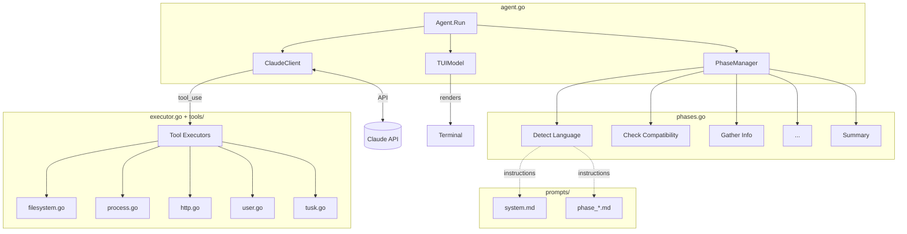

# Agent Package

The agent orchestrates an AI-powered setup flow for Tusk Drift. It uses Claude to guide users through SDK installation, configuration, and testing via an interactive TUI.

## Architecture



## Key Components

```text
agent/
├── agent.go      # Main loop: iterates phases, sends messages to Claude, handles tool calls
├── phases.go     # Defines phases, their tools, and state transitions
├── executor.go   # Tool registry, schema definitions, and executor dispatch
├── types.go      # Message types, API types, State, Config
├── api.go        # Claude API client
├── tui.go        # Terminal UI (bubbletea) for progress, logs, and user interaction
├── prompts.go    # Embeds prompt markdown files
├── prompts/      # System prompt and per-phase instructions (*.md)
└── tools/        # Tool implementations (filesystem, process, http, etc.)
```

## Data Flow

1. **Phase Loop** (`agent.go`): Runs each phase until `transition_phase` is called
2. **Prompt Assembly**: System prompt + phase instructions + current state → Claude
3. **Tool Execution**: Claude returns `tool_use` → executor runs it → result returned
4. **State Updates**: `transition_phase` updates `State` and advances to next phase

## Adding a New Phase

### 1. Create the prompt file

Create `prompts/phase_<name>.md` with instructions for the phase:

```markdown
## Phase: My New Phase

Your goal is to accomplish X.

### Instructions
1. Do A
2. Do B

When complete, call `transition_phase` with:
{
  "results": {
    "my_field": "value"
  }
}
```

### 2. Embed the prompt

In [prompts.go](./prompts.go), add:

```go
//go:embed prompts/phase_my_new.md
var PhaseMyNewPrompt string
```

### 3. Define the phase

In [phases.go](./phases.go), add the phase function:

```go
func myNewPhase() *Phase {
    return &Phase{
        ID:           "my_new",
        Name:         "My New Phase",       // Displayed in TUI
        Description:  "Brief description",
        Instructions: PhaseMyNewPrompt,
        Tools: Tools(
            ToolReadFile,
            ToolWriteFile,
            // ... tools this phase needs
            ToolTransitionPhase,
        ),
        Required:      true,  // false = can be skipped
        MaxIterations: 20,    // 0 = use default (50)
        // Optional: inject dynamic content when entering this phase
        OnEnter: func(state *State) string {
            return "Additional context based on state"
        },
    }
}
```

### 4. Register in `defaultPhases()`

Add your phase to the ordered list:

```go
func defaultPhases() []*Phase {
    return []*Phase{
        detectLanguagePhase(),
        checkCompatibilityPhase(),
        myNewPhase(),  // ← insert in correct order
        // ...
    }
}
```

### 5. Update State (if needed)

If your phase produces results, add fields to `State` in `types.go`:

```go
type State struct {
    // ...
    MyField string `json:"my_field"`
}
```

Then handle them in `UpdateState()` in `phases.go`:

```go
if v, ok := results["my_field"].(string); ok {
    pm.state.MyField = v
}
```

## Adding a New Tool

### 1. Implement the executor

Create or edit a file in `tools/` (e.g., `tools/mytool.go`):

```go
package tools

import "encoding/json"

func MyTool(input json.RawMessage) (string, error) {
    var params struct {
        Param1 string `json:"param1"`
    }
    if err := json.Unmarshal(input, &params); err != nil {
        return "", err
    }

    // Do work...

    return "Result message", nil
}
```

### 2. Register the tool

In `executor.go`:

**a) Add the constant:**

```go
const (
    // ...
    ToolMyTool ToolName = "my_tool"
)
```

**b) Add the definition in `toolDefinitions()`:**

```go
ToolMyTool: {
    Name:        ToolMyTool,
    Description: "What this tool does and when to use it",
    InputSchema: json.RawMessage(`{
        "type": "object",
        "properties": {
            "param1": {
                "type": "string",
                "description": "Description of param1"
            }
        },
        "required": ["param1"]
    }`),
    RequiresConfirmation: false,  // true = ask user before executing
},
```

**c) Wire up the executor in `RegisterTools()`:**

```go
executorMap := map[ToolName]ToolExecutor{
    // ...
    ToolMyTool: tools.MyTool,
}
```

### 3. Add to phases

In `phases.go`, include the tool in relevant phases:

```go
Tools: Tools(
    ToolReadFile,
    ToolMyTool,  // ← add here
    ToolTransitionPhase,
),
```

## Notes

- **Model**: Agent is currently configured to use Claude Sonnet 4.5. We may allow model customization in the future, if necessary.
- **Sandboxing**: Commands run via `run_command` are sandboxed using [fence](https://github.com/anthropics/fence). See `tools/process.go`.
